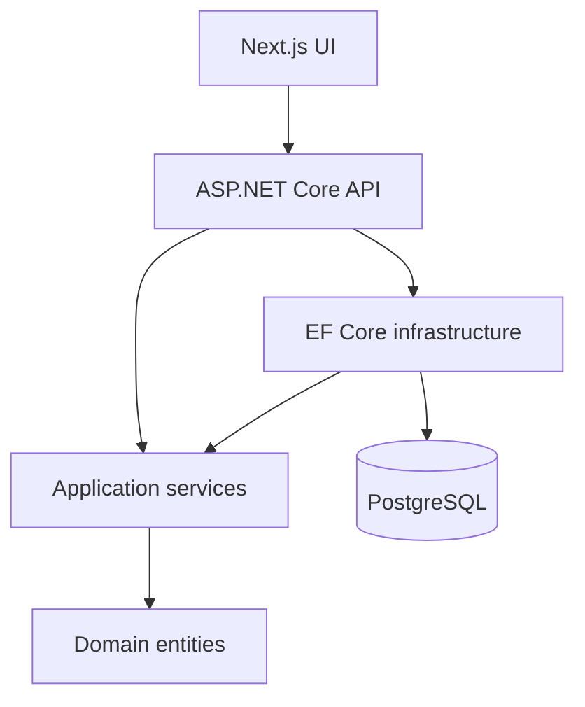

<div align="center">

# PlannerApp

**Turn long-term goals into yearly, monthly, weekly, and daily action.**

[](https://github.com/iamalijafari/PlannerApp/actions/workflows/ci.yml)
[](https://dotnet.microsoft.com/)
[](https://nextjs.org/)
[](https://www.postgresql.org/)
[](https://docs.docker.com/compose/)
[](LICENSE)


</div>

PlannerApp is an open-source, bilingual planning platform built to demonstrate production-minded full-stack engineering. A top-level goal becomes an ordered hierarchy of yearly, monthly, weekly, and daily plans, while English/Persian localization and Gregorian/Jalali date handling keep the experience accessible in both left-to-right and right-to-left layouts.

## Why this project stands out

| Area         | Implementation                                                                                                 |
| ------------ | -------------------------------------------------------------------------------------------------------------- |
| Backend      | ASP.NET Core 9 REST API organized with Clean Architecture, dependency injection, repositories, and services    |
| Frontend     | Next.js 16 App Router, React 19, TypeScript, responsive UI, and centralized API access                         |
| Data         | PostgreSQL 16, Entity Framework Core migrations, UTC date normalization, and deterministic due-date ordering   |
| Localization | English and Persian dictionaries, RTL presentation, and Gregorian/Jalali date selection                        |
| Quality      | xUnit unit tests, NSubstitute test doubles, coverage collection, linting, type-checking, and production builds |
| Delivery     | Multi-stage Dockerfiles, Docker Compose orchestration, health checks, and GitHub Actions CI                    |

## Features

- Create, edit, complete, and delete goals.
- Break each goal into yearly → monthly → weekly → daily plans.
- Explore and manage the entire plan hierarchy from a tree view.
- Order every returned list and nested tree level by due date.
- Switch between English and Persian with RTL-aware presentation.
- Select dates using Gregorian or Jalali calendar values.
- Normalize dates to UTC before PostgreSQL persistence.
- Inspect and exercise the REST API through Swagger UI.

## Architecture



Dependencies point toward the domain and application abstractions. The API composes the application, infrastructure, middleware, and transport models; infrastructure implements repository contracts owned by the application layer.

## Technology stack

- **API:** .NET 9, ASP.NET Core, Swashbuckle
- **Application:** C#, service layer, DTOs, mapping extensions
- **Persistence:** Entity Framework Core 9, Npgsql, PostgreSQL 16
- **UI:** Next.js 16, React 19, TypeScript, Tailwind CSS 4
- **Tests:** xUnit, NSubstitute, coverlet
- **Delivery:** Docker, Docker Compose, GitHub Actions

## Run with Docker

### Prerequisites

- Docker Engine with Docker Compose v2
- Ports `3000`, `5010`, and `5432` available

```bash
git clone https://github.com/iamalijafari/PlannerApp.git
cd PlannerApp
git switch main
docker compose up -d --build
```

Once the containers are healthy:

| Service         | URL                           |
| --------------- | ----------------------------- |
| Web application | http://localhost:3000         |
| API             | http://localhost:5010/api     |
| Swagger UI      | http://localhost:5010/swagger |
| Health check    | http://localhost:5010/health  |

Stop the stack with:

```bash
docker compose down
```

Add `--volumes` only when you intentionally want to remove the local PostgreSQL data volume.

## Run locally

### Prerequisites

- .NET 9 SDK
- Node.js 22+
- PostgreSQL 16

### API

Set `ConnectionStrings:DefaultConnection` in `Planner.Api/appsettings.json`, then run:

```bash
dotnet restore PlannerApp.sln
dotnet ef database update \
  --project Planner.Infrastructure \
  --startup-project Planner.Api
dotnet run --project Planner.Api
```

### UI

```bash
cd planner.ui
cp .env.example .env.local
npm ci
npm run dev
```

The UI reads `NEXT_PUBLIC_API_URL`; its local default is `http://localhost:5010/api`.

## Tests and quality checks

Run the backend test suite with coverage:

```bash
dotnet test Planner.UnitTests/Planner.UnitTests.csproj \
  --collect:"XPlat Code Coverage"
```

The tests exercise:

- UTC normalization and domain validation
- service validation and repository interactions
- successful completion behavior
- failure-to-result error handling
- due-date ordering at every hierarchy level

Run the frontend checks:

```bash
cd planner.ui
npm ci
npm run lint
npm run typecheck
npm run build
```

The [CI workflow](.github/workflows/ci.yml) runs backend restore/build/tests with coverage, frontend lint/type-check/build, and Docker Compose image builds for pushes and pull requests.

## API documentation

See [docs/API.md](docs/API.md) for the endpoint catalog, request shapes, response envelope, date conventions, and Swagger instructions.

The primary resource hierarchy is:

```text
Goal
└── YearlyPlan
    └── MonthlyPlan
        └── WeeklyPlan
            └── DailyPlan
```

## Repository structure

```text
PlannerApp/
├── Planner.Domain/          # Entities and domain invariants
├── Planner.Application/     # Use cases, DTOs, contracts, and mappings
├── Planner.Infrastructure/  # EF Core, repositories, and migrations
├── Planner.Api/             # Controllers, transport models, and middleware
├── Planner.UnitTests/       # Domain and application unit tests
├── planner.ui/              # Next.js application
├── docs/                    # Focused technical documentation
├── assets/                  # README and social media artwork
├── .github/workflows/       # Automated build and test pipeline
├── Dockerfile.api
├── Dockerfile.ui
└── docker-compose.yml
```

## Project documentation

- [API reference](docs/API.md)
- [Engineering and refactoring notes](REFACTORING_SUMMARY.md)
- [Documentation index](DOCUMENTATION_INDEX.md)
- [MIT license](LICENSE)

## Portfolio assets

- [`assets/github-social-preview.png`](assets/github-social-preview.png) — 1280 × 640
- [`assets/readme-hero.png`](assets/readme-hero.png) — 1600 × 900
- [`assets/linkedin-post.png`](assets/linkedin-post.png) — 1200 × 627

GitHub social previews are configured in the repository's **Settings → General → Social preview** panel using the prepared social-preview image.

## Scope and next steps

PlannerApp is a portfolio project and currently assumes a trusted single-user environment. Authentication/authorization, observability, rate limiting, and integration/end-to-end tests are natural next steps before a public production deployment.

## License

PlannerApp is available under the [MIT License](LICENSE).
